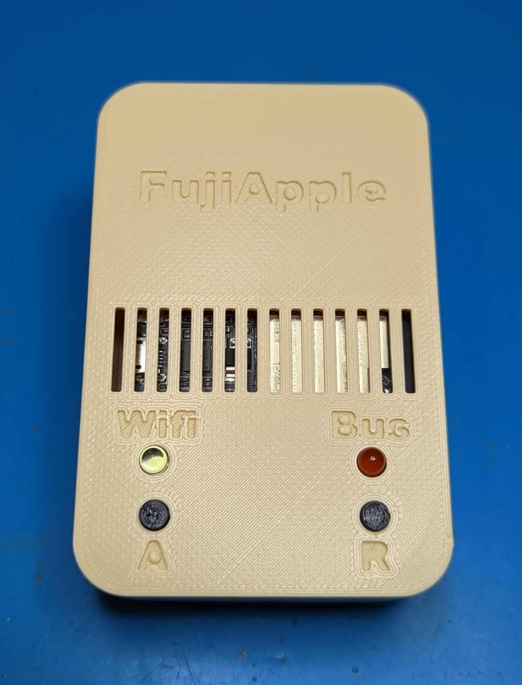
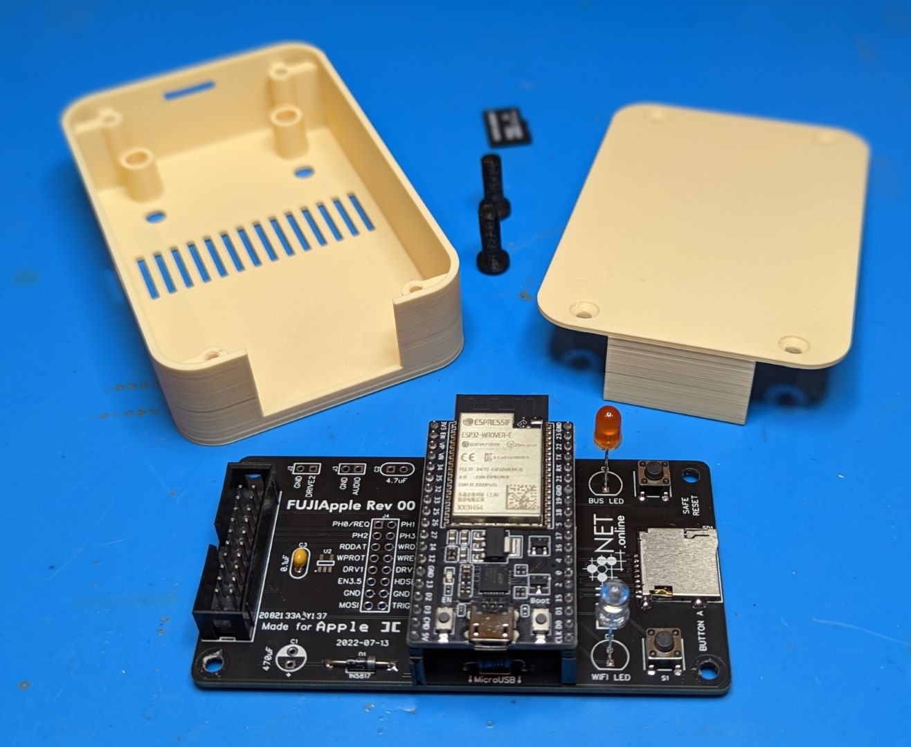
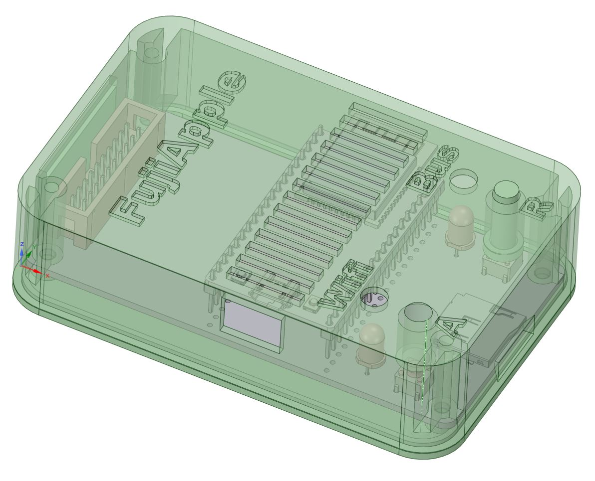

3D printable case for the [Apple II FujiNet Rev00](https://github.com/FujiNetWIFI/fujinet-hardware/tree/master/AppleII/FujiApple-Rev00) board. Pick the button file (4.3mm, 5mm, 6mm) the matches the height of the 6x6mm tact switches you used in your build. The Micro USB cutout is spaced for the ESP32 being installed on standard 8.5mm high female headers. You will also need to space you 5mm LED's away from the board, I use about 2.4mm of reveal above the surface to just get the domes peaking out.

Designed with 0.2mm clearances, prints fine an Ender 3 type printer in PLA with no need for supports. Assemble with four M3x10mm (or longer) countersunk screws.

The Kicad 6 board I created from the gerber files, the STEP file I exported and then modeled around, and the DesignSpark file are also available if you want to modify or improve my design.

